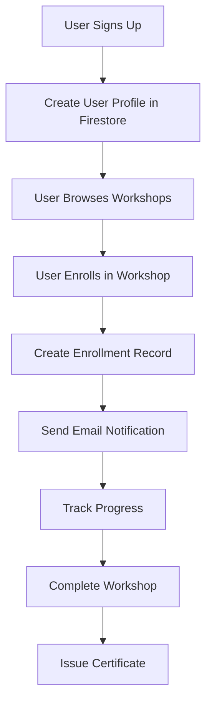

# titliAI Firestore Implementation Plan

## 🎯 **Phase 1: Core Flow Implementation (Week 1-2)**

### **Step 1: Database Setup** ✅ **Ready**
```bash
# 1. Enable Firestore in Firebase Console
# 2. Update Firebase configuration (already done)
# 3. Initialize database service
```

### **Step 2: Workshop Data Migration** 🔄 **Next Priority**
```bash
# Run workshop migration script
node scripts/migrate-workshops-to-firestore.js
```

**This will populate:**
- Beginner Workshop data
- Foundation Workshop data  
- Advance Workshop data
- All curriculum and content

### **Step 3: User Profile Integration** 🔄 **Week 1**
```typescript
// Update AuthContext to create user profile in Firestore
const createUserProfile = async (user) => {
  const db = await getDatabaseService();
  await db.createUser({
    uid: user.uid,
    email: user.email,
    displayName: user.displayName,
    photoURL: user.photoURL,
    profile: {
      firstName: '',
      lastName: '',
      phone: '',
      location: '',
      bio: '',
      interests: [],
      skillLevel: 'beginner'
    },
    preferences: {
      emailNotifications: true,
      marketingEmails: true,
      newsletter: true
    },
    stats: {
      totalEnrollments: 0,
      completedWorkshops: 0,
      certificatesEarned: 0,
      lastActive: new Date()
    }
  });
};
```

### **Step 4: Enrollment System** 🔄 **Week 1-2**
```typescript
// Replace localStorage with Firestore enrollments
const enrollUserInWorkshop = async (userId, workshopId, paymentData) => {
  const db = await getDatabaseService();
  
  const result = await db.enrollUserInWorkshop(userId, workshopId, paymentData);
  
  // Send email notification
  await sendEnrollmentEmail(userId, workshopId);
  
  return result;
};
```

### **Step 5: Workshop Components Update** 🔄 **Week 2**
```typescript
// Update BeginnerWorkshop.tsx to use Firestore
const BeginnerWorkshop = () => {
  const [workshop, setWorkshop] = useState(null);
  const [enrollment, setEnrollment] = useState(null);
  
  useEffect(() => {
    const loadWorkshopData = async () => {
      const db = await getDatabaseService();
      const workshopData = await db.getWorkshop('beginner');
      setWorkshop(workshopData);
      
      if (user) {
        const isEnrolled = await db.isUserEnrolled(user.uid, 'beginner');
        if (isEnrolled) {
          const enrollments = await db.getUserEnrollments(user.uid);
          const enrollmentData = enrollments.find(e => e.workshopId === 'beginner');
          setEnrollment(enrollmentData);
        }
      }
    };
    
    loadWorkshopData();
  }, [user]);
};
```

## 🚀 **Implementation Flow**

### **Week 1: Foundation**
1. **Day 1-2**: Database setup and workshop migration
2. **Day 3-4**: User profile integration
3. **Day 5-7**: Basic enrollment system

### **Week 2: Core Features**
1. **Day 1-3**: Update workshop components to use Firestore
2. **Day 4-5**: Payment integration with enrollment
3. **Day 6-7**: Real-time updates and testing

### **Week 3: Advanced Features**
1. **Day 1-3**: Progress tracking and analytics
2. **Day 4-5**: Admin panel for workshop management
3. **Day 6-7**: Performance optimization and monitoring

## 📊 **Data Flow Architecture**

### **User Journey with Firestore**



### **Database Collections**

```typescript
// Firestore Collections Structure
users: {
  [userId]: {
    uid, email, displayName, photoURL,
    profile: { firstName, lastName, phone, location, bio },
    preferences: { emailNotifications, marketingEmails, newsletter },
    stats: { totalEnrollments, completedWorkshops, certificatesEarned }
  }
}

workshops: {
  [workshopId]: {
    id, title, description, level, price, currency,
    duration, format, certificate, status, featured,
    overview: { duration, level, format, certificate, description },
    curriculum: [{ topic, hours, subTopics }]
  }
}

enrollments: {
  [enrollmentId]: {
    userId, workshopId, status, enrolledAt,
    payment: { amount, currency, status, paymentMethod },
    progress: { currentModule, completedModules, percentageComplete }
  }
}

payments: {
  [paymentId]: {
    userId, workshopId, enrollmentId, amount, currency,
    status, paymentMethod, razorpay: { paymentId, orderId }
  }
}
```

## 🔄 **Migration from Current System**

### **Step 1: Workshop Data**
```bash
# Run migration script
npm run migrate:workshops
```

### **Step 2: User Data**
```typescript
// Migrate existing users on first login
const migrateUserData = async (user) => {
  const db = await getDatabaseService();
  const existingUser = await db.getUser(user.uid);
  
  if (!existingUser) {
    // Create new user profile
    await db.createUser({
      uid: user.uid,
      email: user.email,
      displayName: user.displayName,
      photoURL: user.photoURL
    });
  }
};
```

### **Step 3: Enrollment Data**
```typescript
// Migrate localStorage enrollments to Firestore
const migrateEnrollments = async (userId) => {
  const beginnerEnrolled = localStorage.getItem('enrolled_beginner');
  const foundationEnrolled = localStorage.getItem('enrolled_foundation');
  const advanceEnrolled = localStorage.getItem('enrolled_advance');
  
  const db = await getDatabaseService();
  
  if (beginnerEnrolled === 'true') {
    await db.enrollUserInWorkshop(userId, 'beginner');
  }
  if (foundationEnrolled === 'true') {
    await db.enrollUserInWorkshop(userId, 'foundation');
  }
  if (advanceEnrolled === 'true') {
    await db.enrollUserInWorkshop(userId, 'advance');
  }
};
```

## 🎯 **Key Benefits After Implementation**

### **1. Real-time Updates**
```typescript
// Real-time enrollment updates
const unsubscribe = db.onUserEnrollments(userId, (enrollments) => {
  setUserEnrollments(enrollments);
});
```

### **2. Scalable Data Structure**
```typescript
// Easy to add new features
- User progress tracking
- Workshop analytics
- Payment history
- Certificate management
```

### **3. Easy Migration Path**
```typescript
// Switch to MongoDB in 5 minutes
export const DATABASE_CONFIG = {
  type: 'mongodb', // Changed from 'firestore'
  connectionString: 'mongodb://localhost:27017/titliai'
};
```

## 📋 **Implementation Checklist**

### **Week 1**
- [ ] Enable Firestore in Firebase Console
- [ ] Run workshop migration script
- [ ] Update user authentication to create Firestore profiles
- [ ] Implement basic enrollment system
- [ ] Test data migration

### **Week 2**
- [ ] Update workshop components to use Firestore
- [ ] Implement real-time enrollment updates
- [ ] Add payment integration with enrollment
- [ ] Test all enrollment flows
- [ ] Performance optimization

### **Week 3**
- [ ] Add progress tracking
- [ ] Implement analytics dashboard
- [ ] Create admin panel for workshop management
- [ ] Add certificate generation
- [ ] Final testing and deployment

## 🚀 **Next Steps**

1. **Enable Firestore** in your Firebase Console
2. **Run the migration script** to populate workshop data
3. **Update AuthContext** to create user profiles
4. **Update workshop components** to use Firestore
5. **Test the complete flow**

This implementation will give you a **modern, scalable, database-driven platform** that's ready for growth and easy to migrate to other databases in the future!

Would you like me to help you start with any specific step? 